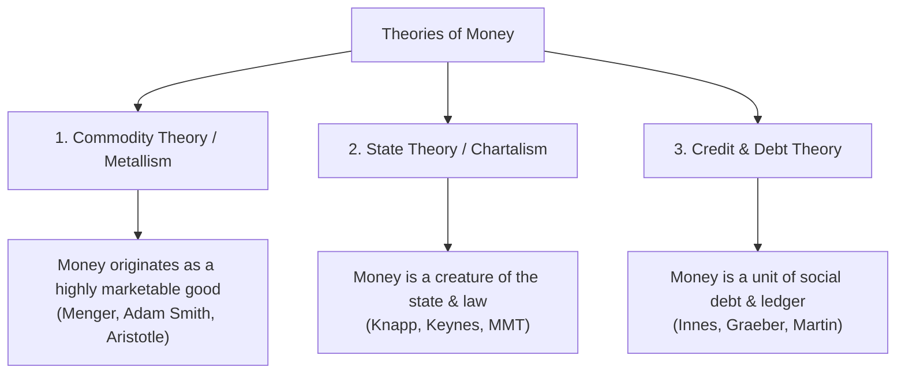
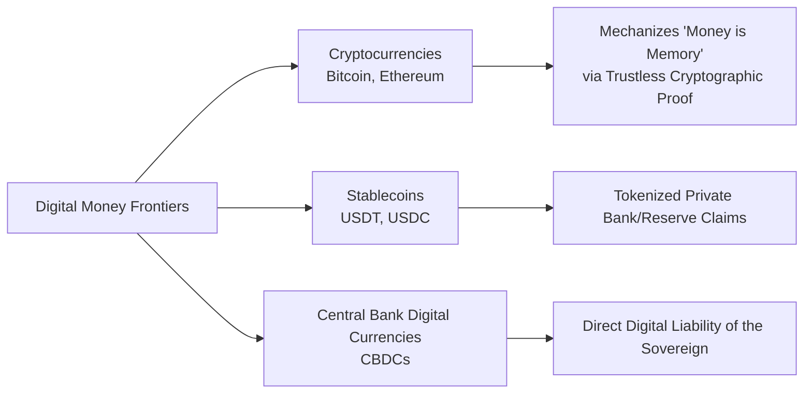

# The Nature of Money: Philosophy, Economics, and Social Ontology

> *"Money is a matter of functions four: a medium, a measure, a standard, a store."*  
> — Traditional Economics Rhyme

---

## 1. The Core Paradox: The Worthless Paper That Buys the World

The fundamental question of monetary theory is deceptively simple: **Why does a physically worthless piece of cotton-linen paper (or numbers in a computer database) command real human labor, land, wheat, steel, and technology?**

A 100-dollar bill costs roughly 14 cents to manufacture. Chemically and physically, it is essentially useless—it cannot shelter you, nourish you, or keep you warm. Yet people spend decades of their lives working 40+ hours a week solely to accumulate these tokens.

Across history, philosophers, economists, anthropologists, and computer scientists have investigated this phenomenon. Their research reveals that **money is not a physical object; money is an abstract social institution, a system of accounting, and a collective agreement.**

---

## 2. The Three Major Theoretical Traditions in Monetary Research

Monetary literature is broadly divided into three foundational paradigms regarding the origin, nature, and source of money's value:



---

### A. Commodity Theory & Metallism (The Mengerian View)

* **Key Figures:** Aristotle (*Politics*), Adam Smith (*The Wealth of Nations*, 1776), Carl Menger (*On the Origins of Money*, 1892), Ludwig von Mises (*The Theory of Money and Credit*, 1912).
* **Core Idea:** Money emerges spontaneously from market exchange to solve the **"double coincidence of wants"** in barter.

#### Mechanism:
1. In direct barter, trade only occurs if Person A has what Person B wants, and Person B has what Person A wants at the same time and place.
2. Carl Menger argued that certain commodities have higher **saleableness** (*Absatzfähigkeit* or market liquidity)—such as salt, cattle, shells, silver, and gold.
3. Rational traders begin accepting these liquid commodities not for direct consumption, but because they know others will readily accept them.
4. Over centuries, precious metals (gold and silver) became the dominant standard due to their physical attributes: **durability, divisibility, portability, uniformity, and scarcity**.
5. Paper money began as **warehouse receipts** (claims on gold stored with goldsmiths or banks). Over time, governments severed the physical gold backing, leaving pure **fiat money** (*fiat* = Latin for "let it be done").

---

### B. State Theory & Chartalism (The Knappian View)

* **Key Figures:** Georg Friedrich Knapp (*The State Theory of Money*, 1905), John Maynard Keynes (*A Treatise on Money*, 1930), Abba Lerner (1947), Modern Monetary Theory (L. Randall Wray, Stephanie Kelton).
* **Core Idea:** Money is fundamentally a **creature of law and the state** (*charta* = Latin for ticket, token, or charter).

#### Mechanism:
1. The sovereign or government defines the **unit of account** (e.g., Dollar, Pound, Yen).
2. The state imposes a compulsory obligation on its citizens: **taxes and fees**.
3. The state declares that taxes must be settled **exclusively in the state's chosen currency**.
4. Consequently, citizens need the state's paper currency to avoid punishment or imprisonment. People accept paper money in exchange for real goods and services because they (or their customers/employers) need it to pay their taxes.
5. **Key Maxim:** *"Taxes drive money."* Fiat paper has value not because of gold, but because the government creates a non-negotiable structural demand for it and enforces its acceptance by law (**legal tender**).

---

### C. Credit & Debt Theory (The Anthropological & Ledger View)

* **Key Figures:** Henry Dunning Macleod (1889), A. Mitchell Innes (*What is Money?*, 1913; *The Credit Theory of Money*, 1914), David Graeber (*Debt: The First 5,000 Years*, 2011), Felix Martin (*Money: The Unauthorized Biography*, 2013).
* **Core Idea:** Money was never a physical commodity; it has always been a **credit/debit relationship recorded on a ledger**.

#### Mechanism:
1. **The Barter Myth:** Anthropologists (such as Graeber and Caroline Humphrey) showed that historical societies never functioned via pure barter. Ancient Mesopotamian temples (3000 BCE) used silver as an abstract accounting unit on clay tablets long before silver coins were minted.
2. In early communities, transactions were informal credit: *"I give you a cow today; you owe me something of equal value later."*
3. When credit relationships become standardized, transferable, and third-party negotiable, **the credit receipt itself becomes money**.
4. A paper banknote is essentially an IOU (Promissory Note). When you hold a dollar, you hold a standardized, transferable social token of credit against society.

> [!NOTE]
> **Scholarly Debate (Post-2020):** Graeber's "barter myth" thesis remains widely influential and cited as groundbreaking. However, post-2020 academic reception has become more nuanced. Critics (including economic historians at *EconLib*, *Cato*, and various peer-reviewed journals) argue his definition of barter is sometimes "tautological" and his framework can be polemical. The consensus view treats his anthropological insights as a valuable *complement* to economic analysis, rather than a wholesale replacement. The document presents Graeber's framework as one important lens among several.

---

## 3. How Modern Money is Actually Created (The Endogenous Money Reality)

One of the most persistent misconceptions—often still taught in introductory economics textbooks—is the **"Fractional Reserve / Money Multiplier" model** (the idea that banks wait for customer cash deposits and then lend out a fraction). 

In reality, modern central banks and accounting standards confirm that **bank lending creates new deposits *ex nihilo* (out of nothing)**.

---

### A. The Bank of England Landmark Clarification (2014)

In the *Bank of England Quarterly Bulletin* (2014 Q1), central bank economists Michael McLeay, Amar Radia, and Ryland Thomas published the definitive institutional explanation (*"Money creation in the modern economy"*):

> *"In the modern economy, most money takes the form of bank deposits. But how those bank deposits are created is often misunderstood: the principal way is through commercial banks making loans. **Whenever a bank makes a loan, it simultaneously creates a matching deposit in the borrower’s bank account, thereby creating new money.**"*  
> — McLeay, Radia, & Thomas (Bank of England, 2014)

> *"Commercial banks do not act simply as intermediaries, lending out deposits that savers place with them, nor do they 'multiply up' central bank money to create new loans and deposits."*  
> — Bank of England (2014)

```
┌────────────────────────────────────────────────────────┬────────────────────────────────────────────────────────┐
│               TEXTBOOK MYTH (INTERMEDIATION)           │                CENTRAL BANK REALITY (ENDOGENOUS)       │
├────────────────────────────────────────────────────────┼────────────────────────────────────────────────────────┤
│ 1. Saver deposits $10,000 cash in Bank A.              │ 1. Borrower asks Bank A for a $300,000 mortgage.       │
│ 2. Bank A keeps $1,000 reserve, lends $9,000.          │ 2. Bank A evaluates creditworthiness, approves loan.   │
│ 3. Borrower deposits $9,000 in Bank B.                 │ 3. Bank A types +$300,000 into borrower's deposit.     │
│ 4. "Money multiplier" repeats to expand money supply.   │ 4. **$300,000 of new money is instantly created.**    │
│ ──► Deposits create loans; savings precede lending.     │ ──► **Loans create deposits; lending precedes funding.**│
└────────────────────────────────────────────────────────┴────────────────────────────────────────────────────────┘
```

---

### B. Step-by-Step Accounting Walkthrough (T-Accounts)

To understand exactly how money is created, transferred, and destroyed, consider a concrete numerical scenario where **Alice** borrows **\$300,000** from **Bank A** to buy a home from **Bob** (who holds an account at **Bank B**).

#### Step 1: Loan Origination (Money Created *Ex Nihilo*)
When Bank A approves Alice’s mortgage, it does **not** transfer cash from someone else's account. It simply expands both sides of its balance sheet:
* **Asset:** Bank A creates a new financial asset: *"Loan contract owed by Alice"* ($+\$300,000$).
* **Liability:** Bank A creates a new financial liability: *"Alice's Demand Deposit"* ($+\$300,000$).

```
                      BANK A BALANCE SHEET (Step 1: Loan Approved)
            ASSETS (+)                                    LIABILITIES (+)
┌──────────────────────────────────────┐        ┌──────────────────────────────────────┐
│  + $300,000 Loan to Alice            │        │  + $300,000 Alice's Deposit Account  │
│  (Bank's legal claim on Alice)       │        │  (Bank's IOU to Alice / NEW MONEY)   │
└──────────────────────────────────────┘        └──────────────────────────────────────┘
```
> **Net Economic Effect:** The broad money supply ($M_1/M_2$) in the economy has increased by **\$300,000 in this exact millisecond**.

---

#### Step 2: The Payment & Interbank Settlement (Why Reserves Matter)
Alice transfers the \$300,000 to Bob to purchase the house. Because Bob banks with **Bank B**, Bank A must settle the payment with Bank B.

Commercial banks cannot pay each other with commercial bank deposits; they settle interbank debts using **Central Bank Reserves** (electronic tokens held at the Federal Reserve / Bank of England):

1. Alice's deposit at Bank A drops to \$0 ($-\$300,000$).
2. Bank A transfers \$300,000 of **Central Bank Reserves** to Bank B via the central bank clearing network (Fedwire / CHAPS).
3. Bank B credits Bob's checking account with +\$300,000.

```
                      BANK A BALANCE SHEET (Step 2: After Transfer)
            ASSETS                                        LIABILITIES
┌──────────────────────────────────────┐        ┌──────────────────────────────────────┐
│  + $300,000 Loan to Alice            │        │  - $300,000 Alice's Deposit Account  │
│  - $300,000 Central Bank Reserves    │        │  (Alice's balance returns to $0)     │
└──────────────────────────────────────┘        └──────────────────────────────────────┘

                      BANK B BALANCE SHEET (Step 2: After Transfer)
            ASSETS                                        LIABILITIES
┌──────────────────────────────────────┐        ┌──────────────────────────────────────┐
│  + $300,000 Central Bank Reserves    │        │  + $300,000 Bob's Deposit Account    │
│  (Received from Bank A)              │        │  (Bob's spending money / NEW MONEY)  │
└──────────────────────────────────────┘        └──────────────────────────────────────┘
```
> **Net Economic Effect:** Bank A now holds a long-term interest-bearing loan asset, Bank B holds central bank liquid reserves, and Bob possesses \$300,000 of newly created bank money ready to be spent across the economy.

---

#### Step 3: Loan Repayment (Money Destruction)
What happens as Alice works, earns money, and pays down her mortgage principal?

As Alice transfers deposits back to Bank A to pay off her loan:
* Alice's deposit account decreases ($-\$300,000$).
* Bank A's loan asset decreases ($-\$300,000$).

```
                      BANK A BALANCE SHEET (Step 3: Loan Fully Repaid)
            ASSETS (-)                                    LIABILITIES (-)
┌──────────────────────────────────────┐        ┌──────────────────────────────────────┐
│  - $300,000 Loan to Alice            │        │  - $300,000 Alice's Deposit Account  │
│  (Asset extinguished)                │        │  (Deposit extinguished / DESTROYED) │
└──────────────────────────────────────┘        └──────────────────────────────────────┘
```
> *"Just as taking out a loan creates money, the repayment of bank loans destroys money."*  
> — Bank of England (2014)

---

### C. What Limits Bank Money Creation? (Why Banks Cannot Create Infinite Money)

If commercial banks can create money simply by typing on a keyboard, why don't they create trillions of dollars in loans overnight?

Commercial banks face **four hard economic constraints**:

```
                               4 CONSTRAINTS ON MONEY CREATION
                                              │
         ┌───────────────────────────┬────────┴──────────────────┬───────────────────────────┐
         ▼                           ▼                           ▼                           ▼
 ┌───────────────┐           ┌───────────────┐           ┌───────────────┐           ┌───────────────┐
 │ 1. Loss of    │           │ 2. Borrower   │           │ 3. Regulatory │           │ 4. Central    │
 │    Reserves   │           │    Demand &   │           │    Capital    │           │    Bank Rates │
 │ (Interbank    │           │    Credit     │           │    (Basel     │           │ (Policy Rate  │
 │  Competition) │           │    Risk       │           │    Buffers)   │           │  Cost)        │
 └───────────────┘           └───────────────┘           └───────────────┘           └───────────────┘
```

1. **Interbank Competition & Reserve Drain:** If Bank A expands lending far faster than other banks, its customers will spend money at other banks, draining Bank A of all its Central Bank Reserves. Bank A would have to borrow expensive emergency reserves or face insolvency.
2. **Credit Risk & Profitability:** Banks only lend when they expect the borrower to repay principal and interest. If a bank makes bad loans, defaults wipe out the bank's own shareholders' equity.
3. **Regulatory Capital Adequacy (Basel III/IV):** International regulations require banks to maintain a minimum buffer of equity capital (e.g., 8–12% of risk-weighted assets). A bank cannot expand its loan book without having enough equity capital to absorb potential losses.
4. **Central Bank Monetary Policy:** Central banks do not set the *quantity* of money directly; they set the **price of reserves (the policy interest rate)**. By raising or lowering interest rates, the central bank influences the interest rates commercial banks charge, which directly controls the total public demand for new loans.

---

## 4. The Hierarchy of Money (Perry Mehrling's "Money View")

Money is not a single uniform substance; it exists as a **stratified pyramid of credit instruments**, where each layer is a promise to pay the layer above it:

```
                  ▲
                 / \
                /   \     1. Ultimate Reserve Asset (Historically Gold / Foreign Reserves)
               /-----\
              /       \    2. Central Bank Money (Physical Cash + Central Bank Reserves)
             /---------\
            /           \   3. Commercial Bank Money (Bank Deposits, Checking Accounts)
           /-------------\
          /               \  4. Private / Shadow Bank Credit (Commercial Paper, Repos, IOUs)
         /─────────────────\
```

* **In normal times:** All levels trade at par (1 deposit dollar = 1 paper dollar).
* **In a liquidity crisis:** The pyramid contracts downward. Everyone flees from lower-level private credit into the higher-level state cash and central bank reserves.

---

## 5. Philosophical & Social Ontological Foundations

How can something exist and possess immense power if it is physically just paper or digits?

```
+---------------------------------------------------------------------------------------+
|                                 Levels of Reality                                     |
+---------------------------------------------------------------------------------------+
|  1. Brute Physical Reality   : Atoms, gravity, paper, cotton, ink, silicon circuits   |
|  2. Subjective Reality       : Personal feelings, individual pain, personal taste     |
|  3. Inter-subjective Reality : Money, laws, corporations, human rights, nations       |
+---------------------------------------------------------------------------------------+
```

### 1. John Searle: Social Ontology & Status Functions
In *The Construction of Social Reality* (1995) and *Making the Social World* (2010), American philosopher John Searle analyzed the structure of institutional facts:

* **Brute Facts vs. Institutional Facts:** A piece of paper having cellulose fibers is a brute physical fact. That same piece of paper being worth \$100 is an institutional fact.
* **The Constitutive Rule Formula:**
  $$\text{Object } X \text{ counts as } Y \text{ in Context } C$$
  - $X$ = A printed green slip of cotton paper.
  - $Y$ = A $100 medium of exchange / legal tender.
  - $C$ = Under the jurisdiction of the United States Federal Reserve system.
* **Collective Intentionality:** The function $Y$ exists purely because human beings collectively recognize, accept, and act upon the belief that $X$ has this status function. If everyone ceases to recognize it, the status function collapses instantaneously into brute paper.

---

### 2. Georg Simmel: The Philosophy of Money (1900)
The German sociologist and philosopher Georg Simmel provided one of the deepest cultural analyses of money:

* **Money as Pure Relation:** Money is the purest embodiment of human social interaction. It strips away the unique, qualitative nature of things (art, food, labor, time) and translates them into a single, quantitative scale.
* **Crystallized Trust:** Simmel described money as an institution built on general social trust. When you accept money, you are not placing trust in the paper itself, but in the entire socio-political order that surrounds you.

---

### 3. Yuval Noah Harari: Shared Fictions & Intersubjectivity
In *Sapiens: A Brief History of Humankind* (2014), Harari highlighted money as the most universal and successful fiction ever invented:

* Humans cooperate flexibly in large numbers because of our ability to believe in **inter-subjective realities** (concepts that exist within the shared communication network of millions of minds).
* Unlike religion (which divides believers) or nationalism (which creates borders), money is based on **mutual trust in what *others* believe**:
  > *"You may not believe in my God or my King, but you believe in my dollar, because you know your neighbor also believes in it."*

---

## 6. Information Theory, Game Theory & Cognitive Foundations

### A. Narayana Kocherlakota: *"Money is Memory"* (1998)
In a landmark paper in the *Journal of Economic Theory*, Narayana Kocherlakota proved mathematically:

* In an ideal economy with **perfect, costless record-keeping (memory)** where every agent's past contributions and consumption are universally tracked in real time, **physical money is completely unnecessary**.
* Agents would simply deliver goods to others, and their societal credit balance would entitle them to receive goods later.
* **Conclusion:** Money is a decentralized, portable substitute for public memory. The token is a physical surrogate for the ledger entry: *"The bearer has contributed real value to the economy in the past and is entitled to claim value now."*

---

### B. Game Theory: Coordination Equilibria & Schelling Points
* **Kiyotaki & Wright (1989)** modeled monetary exchange in search-theoretic frameworks.
* Money functions as a **self-enforcing Nash Equilibrium**:
  - Strategy 1: Accept paper money.
  - Strategy 2: Refuse paper money.
* If every other market participant plays Strategy 1, your best mathematical response is also Strategy 1.
* A dollar bill is a **Schelling focal point**—a convention everyone coordinates around because everyone expects everyone else to coordinate around it.

---

### C. Neuroeconomics & Behavioral Foundations
* **Neuroimaging Research (Knutson et al., 2007; Camerer et al., 2005):** Brain imaging using the Monetary Incentive Delay (MID) task shows that **anticipation** of monetary reward consistently activates the **nucleus accumbens (NAcc)**, a core node of the mesolimbic reward system. This established the neural basis for why abstract financial tokens acquire motivational salience through conditioning.
* **Current State of the Field (2023–2024):** The field has evolved beyond simple localization ("which spot lights up for money"). Contemporary neuroeconomics uses **multimodal approaches** combining fMRI with PET scanning (which can directly measure dopamine release) to build more mechanistic and network-based models of reward. Active scholarly debate continues over whether fMRI BOLD signals are a reliable proxy for actual dopamine dynamics, and researchers warn against oversimplifying complex brain-network activity to a single "money = reward" mapping.
* **The "Money Illusion" (Shafir, Diamond, & Tversky, 1997):** Humans have an innate cognitive bias to think of money in nominal terms rather than real purchasing power terms, cementing our intuitive belief that money has inherent value.

---

## 7. The 21st-Century Frontiers: Cryptocurrencies, CBDCs & Digital Cash

The digital era has brought the philosophical debate full circle, testing what money is when paper itself disappears:



1. **Cryptocurrencies & Trustless Consensus (Satoshi Nakamoto, 2008):**
   * Bitcoin mechanized Kocherlakota's *"Money is Memory"* without needing a central bank or government. The distributed blockchain ledger acts as the societal memory, replacing institutional trust with mathematical and cryptographic proof.
2. **Central Bank Digital Currencies (CBDCs) — Retail vs. Wholesale:**
   * **Retail CBDCs** make direct digital claims on the central bank available to the public — a digital equivalent of cash.
   * **Wholesale CBDCs** (e.g., the **mBridge project**) enable near-instant, low-cost cross-border settlement between financial institutions, bypassing traditional correspondent banking. This area has seen the fastest real-world pilot deployment as of 2025.
3. **The BIS "Money Flower" Taxonomy (Auer & Böhme, 2020):**
   * Classifies all money across four axes: (1) Issuer (Central bank vs. Private), (2) Form (Digital vs. Physical), (3) Accessibility (Widely accessible vs. Wholesale), and (4) Technology (Token-based vs. Account-based).
4. **The Unified Ledger & Design Trilemma (BIS, 2024–2025):**
   * The BIS Annual Economic Report (2025) proposes a **Unified Ledger** — a shared programmable platform where tokenized CBDCs coexist with tokenized commercial bank money and other assets, enabling atomic settlement and new financial applications.
   * Current CBDC policy research is framed around a **Design Trilemma**: inevitable tensions between **(1) Privacy**, **(2) Financial Stability**, and **(3) Regulatory Compliance**. No architecture fully satisfies all three simultaneously.

---

## 8. Comparative Summary: Why Fiat Paper Has Value

| Theoretical Dimension | Why Paper Money Has Value | Key Thinkers / Literatures |
| :--- | :--- | :--- |
| **Social Ontology** | Collective agreement assigns a **Status Function** ($X$ counts as $Y$ in context $C$). | John Searle (*The Construction of Social Reality*) |
| **State / Legal** | The state levies taxes in this specific unit and enforces **legal tender laws**. | Georg Friedrich Knapp, J.M. Keynes, MMT |
| **Endogenous Banking** | Banks create credit/deposits *ex nihilo*; paper is convertible cash for this ledger. | Bank of England (McLeay et al., 2014) |
| **Monetary Hierarchy** | Positioned near the peak of a credit hierarchy backed by sovereign authority. | Perry Mehrling (*The Money View*) |
| **Game Theory** | It is a self-reinforcing **Nash Coordination Equilibrium** based on rational expectations. | Kiyotaki & Wright (1989), Thomas Schelling |
| **Information Theory** | It serves as a decentralized token of **Public Memory / Social Ledger**. | Narayana Kocherlakota (*Money is Memory*, 1998) |
| **Credit / Debt** | It is a standardized, transferable **Promissory Note / Social IOU**. | A. Mitchell Innes (1913), David Graeber (2011) |
| **Neuroeconomics** | Biological dopamine pathways process conditioned financial tokens as primary rewards. | Knutson et al. (2007), Tversky et al. (1997) |
| **Digital / Crypto** | Verification replaces physical commodity; trust is anchored in code or sovereign balance sheets. | Satoshi Nakamoto (2008), BIS (2020) |

---

## 9. What Happens When the System Breaks?

Because paper money is an institutional and informational construct rather than a physical good, its value can evaporate if the underlying institutional pillars fail:

1. **Hyperinflation (Loss of Trust & Scarcity):** Weimar Germany (1923), Zimbabwe (2008), Venezuela (2018). When the issuing authority prints excessive quantities, the coordination equilibrium breaks down, and society flees to commodities or foreign currencies.
2. **State Collapse:** If a government falls, its tax-enforcing capability disappears, rendering its paper worthless unless another entity guarantees it.
3. **Liquidity / Banking Panic:** When confidence in the commercial banking credit layer collapses (e.g., 1929 Great Depression, 2008 Global Financial Crisis), people rush to convert bank digits into central bank cash.

---

## 10. Recommended Reading & Core Bibliography

1. **Philosophy & Social Reality:**
   * Searle, John R. (1995). *The Construction of Social Reality*. Free Press.
   * Simmel, Georg. (1900). *The Philosophy of Money* (*Philosophie des Geldes*).
2. **Anthropology & History of Debt:**
   * Graeber, David. (2011). *Debt: The First 5,000 Years*. Melville House.
   * Martin, Felix. (2013). *Money: The Unauthorized Biography*. Alfred A. Knopf.
3. **Classical, State & Modern Banking Theory:**
   * Menger, Carl. (1892). *"On the Origins of Money"*. *Economic Journal*, 2(6), 239–255.
   * Knapp, Georg Friedrich. (1905). *The State Theory of Money*.
   * Innes, A. Mitchell. (1913). *"What is Money?"*. *The Banking Law Journal*.
   * McLeay, M., Radia, A., & Thomas, R. (2014). *"Money creation in the modern economy"*. *Bank of England Quarterly Bulletin*, Q1.
   * Mehrling, Perry. (2011). *The New Lombard Street: How the Fed Became the Dealer of Last Resort*. Princeton University Press.
4. **Information Theory, Game Theory & Digital Currency:**
   * Kocherlakota, Narayana R. (1998). *"Money is Memory"*. *Journal of Economic Theory*, 81(2), 232–251.
   * Kiyotaki, Nobuhiro, & Wright, Randall. (1989). *"On Money as a Medium of Exchange"*. *Journal of Political Economy*, 97(4), 927–954.
   * Nakamoto, Satoshi. (2008). *"Bitcoin: A Peer-to-Peer Electronic Cash System"*.
   * Auer, R., & Böhme, R. (2020). *"The technology of retail central bank digital currency"*. *BIS Quarterly Review*.
5. **Recent 2023–2025 Additions:**
   * Mehrling, Perry. (2023). *"On Par: A Money View of Stablecoin"*. *BIS Working Papers*, No. 1160.
   * Mehrling, Perry. (2023). *"Exorbitant Privilege? On the rise (and rise) of the global dollar system"*. Boston University/INET Working Paper.
   * Bank for International Settlements. (2025). *BIS Annual Economic Report 2025*. BIS Publications.
   * International Monetary Fund. (2025). *Virtual Handbook on Central Bank Digital Currency*. IMF Publications.
