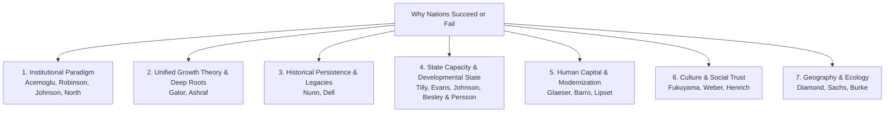
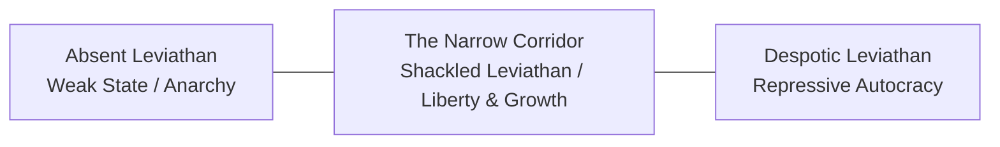

# Why Nations Succeed or Fail: A Comprehensive Literature Review

> *"The reason that Britain is richer than Egypt is because in 1688, Britain had a revolution that transformed the politics and thus the economics of the nation. The people fought for and won more political rights, and they used them to expand their economic opportunities."*  
> — Daron Acemoglu & James A. Robinson, *Why Nations Fail*

---

## 1. The Fundamental Question of Comparative Development

Why are citizens in some nations healthy, wealthy, and secure, while citizens in others struggle with poverty, disease, and instability?

* In 2024–2026, the GDP per capita (PPP) of Switzerland exceeded **\$85,000**, while in Burundi it was under **\$1,000**—an **85-fold difference**.
* Communities divided by a political border—such as Nogales, Arizona (USA) vs. Nogales, Sonora (Mexico), or North Korea vs. South Korea—experience drastically different life outcomes despite sharing identical geography, ancient lineage, and ecological conditions.

Modern academic literature organizes the answers to this question into **seven major theoretical paradigms**, spanning classical political economy to 21st-century econometric research.

---

## 2. Taxonomy of Major Theoretical Frameworks



---

## 3. The Institutional Paradigm (The Modern Consensus)

The institutional paradigm was awarded the **2024 Nobel Memorial Prize in Economic Sciences** (Daron Acemoglu, Simon Johnson, and James A. Robinson) *"for studies of how institutions are formed and affect prosperity."*

```
┌─────────────────────────────────────────────────────────────────────────────┐
│                    THE ACEMOGLU-ROBINSON-JOHNSON FRAMEWORK                  │
├───────────────────────────┬─────────────────────────────────────────────────┤
│ INCLUSIVE INSTITUTIONS    │ EXTRACTIVE INSTITUTIONS                         │
├───────────────────────────┼─────────────────────────────────────────────────┤
│ • Secure property rights  │ • Property subject to elite expropriation       │
│ • Unbiased rule of law    │ • Biased judicial system; impunity for elites   │
│ • Level playing field     │ • Monopolies, entry barriers, crony capitalism  │
│ • Pluralistic politics    │ • Power concentrated in narrow ruling coalition │
│ • Creative destruction    │ • Innovation blocked to preserve elite power    │
└───────────────────────────┴─────────────────────────────────────────────────┘
```

### A. Core Mechanics: Inclusive vs. Extractive Institutions
1. **Inclusive Economic Institutions:** Secure private property rights, enforce contracts objectively, provide public infrastructure and education, and allow free entry for new entrepreneurs.
2. **Inclusive Political Institutions:** Distribute power broadly across society (**pluralism**) while maintaining sufficient **state centralization** to uphold public order and defense.
3. **Extractive Institutions:** Designed by a narrow ruling elite to extract wealth and rents from the broad population, while suppressing political opposition and economic competition.

### B. The Engine: Creative Destruction (Joseph Schumpeter)
Why do extractive rulers actively resist industrialization and modernization?
* Economic growth requires **technological change**, which creates new economic winners and renders old monopolies obsolete (**creative destruction**).
* Autocrats fear creative destruction because it creates newly wealthy, independent groups who will inevitably demand political representation, threatening the ruler's monopoly on power.
* *Historical Case:* In the 19th century, Tsar Nicholas I of Russia and Emperor Francis I of Austria-Hungary explicitly banned railways and factories because they feared industrial workers and industrialists would rebel against the monarchy.

### C. Recent Frontier: "The Narrow Corridor" & The Red Queen Effect (2019)
In *The Narrow Corridor: States, Societies, and the Fate of Liberty* (2019), Acemoglu and Robinson expanded their model beyond simple institutional design:



* **The Shackled Leviathan:** True liberty and sustained prosperity exist only within a "narrow corridor" where a strong, capable state is counterbalanced by an active, organized civil society.
* **The Red Queen Effect:** Just as the Red Queen in *Alice in Wonderland* runs to stay in place, society must constantly mobilize to keep the state accountable as state capacity expands.

### D. Technology, Power, and Progress (Acemoglu & Johnson, 2023)
In *Power and Progress* (2023), Acemoglu and Simon Johnson demonstrated that technological innovation does not automatically benefit ordinary citizens. Without **countervailing institutional power** (e.g., labor rights, democratic oversight), elites capture the gains of automation, leading to wage stagnation and inequality.

> [!NOTE]
> **Active Scholarly Debate on the Institutional Paradigm (2024–Present):** The Nobel Prize award has intensified debate, not closed it. Key ongoing critiques include: (1) **Causality concerns** — it remains difficult to empirically isolate institutional quality from geography, culture, and human capital simultaneously; (2) **The Authoritarian Growth Puzzle** — nations like China, Singapore, and UAE have sustained high economic growth under decidedly non-inclusive political institutions, which the framework struggles to fully account for; (3) **Critics such as Jeffrey Sachs** argue that disease burden and geography are systematically under-weighted relative to institutions in explaining tropical poverty.

---

## 4. Unified Growth Theory: Breaking the Malthusian Trap

* **Key Thinker:** Oded Galor (*Unified Growth Theory*, 2011; *The Journey of Humanity: The Origins of Wealth and Inequality*, 2022).

For nearly 300,000 years of human history, humanity was trapped in the **Malthusian Epoch**: technological progress increased the size of the population, but left per capita living standards roughly near subsistence.

```
                    THE GREAT TRANSITION (1800–PRESENT)
Population Size + Tech Momentum ──► High Return to Education (Human Capital)
                                ──► Demographic Transition (Fewer, better-educated children)
                                ──► Sustained Per Capita GDP Growth (Escape from Malthus)
```

### Core Contributions:
1. **The Phase Transition:** As technology advanced during the Industrial Revolution, the return on human skills (literacy, engineering, science) spiked. Parents shifted from maximizing the *quantity* of children to the *quality* (education) of children.
2. **The Great Divergence:** Regions that fostered environments conducive to education, gender equality, and institutional flexibility underwent the demographic transition earlier, creating the modern global wealth gap.

> [!NOTE]
> **Scholarly Controversy: Ashraf & Galor (2013) — Genetic Diversity and Development:** The linked paper by Quamrul Ashraf and Oded Galor, proposing a "hump-shaped" relationship between genetic diversity (derived from prehistoric out-of-Africa migrations) and long-run economic prosperity, has been **contested in replication studies**. Critics (including Guedes et al., *Current Anthropology*, 2013, and Caraher, 2018) argue the results are sensitive to data selection and question whether neutral genetic markers are valid proxies for economically relevant traits. The paper is cited for its framework, but readers should be aware it remains actively disputed. Galor's broader *Unified Growth Theory* itself (the Malthusian trap mechanism and demographic transition) is more widely accepted.

---

## 5. Historical Persistence & Deep Colonial Legacies

* **Key Economists:** Nathan Nunn (Harvard), Melissa Dell (2020 Clark Medalist), Stelios Michalopoulos, Elias Papaioannou.

Modern econometric research uses historical micro-data and natural experiments to show how distant shocks create persistent path-dependent development outcomes:

```
┌─────────────────────────────────────────────────────────────────────────────┐
│                    LANDMARK HISTORICAL PERSISTENCE FINDINGS                 │
├───────────────────────────┬─────────────────────────────────────────────────┤
│ The African Slave Trades  │ Regions most heavily raided for slaves between  │
│ (Nathan Nunn, QJE 2008)   │ 1400–1900 exhibit significantly lower GDP       │
│                           │ per capita and lower interpersonal trust today. │
├───────────────────────────┼─────────────────────────────────────────────────┤
│ Peru's Mining Mita        │ Areas historically subjected to forced mining   │
│ (Melissa Dell, 2010)      │ labor (*Mita*) in colonial Peru suffer lower    │
│                           │ household consumption and worse road networks.  │
├───────────────────────────┼─────────────────────────────────────────────────┤
│ Pre-Colonial Institutions │ African ethnicities with centralized pre-       │
│ (Michalopoulos &          │ colonial legal structures show higher modern    │
│  Papaioannou, 2013)       │ economic activity (measured by night lights).   │
└───────────────────────────┴─────────────────────────────────────────────────┘
```

---

## 6. State Capacity & The Developmental State Model

* **Key Thinkers:** Charles Tilly (*Coercion, Capital, and European States*, 1990), Chalmers Johnson (*MITI and the Japanese Miracle*, 1982), Alice Amsden (1989), Robert Wade (1990), Timothy Besley & Torsten Persson (*Pillars of Prosperity*, 2011), Yuen Yuen Ang (*How China Escaped the Poverty Trap*, 2016).


### Core Arguments:
1. **Pillars of Prosperity (Besley & Persson, 2011):** Development requires a two-way cluster of **Fiscal Capacity** (the ability to collect broad taxes) and **Legal Capacity** (the ability to enforce contracts and property rights).
2. **The East Asian Developmental State:** Nations like **Japan, South Korea, Taiwan, and Singapore** used meritocratic, Weberian bureaucracies that directed credit to strategic industries while enforcing **export discipline** (subsidies were revoked if firms failed to compete in global markets).
3. **Coevolutionary Development in China (Yuen Yuen Ang, 2016, updated 2023):** China's rise demonstrated that markets and state institutions can co-evolve through local bureaucratic **"Directed Improvisation"** — Beijing sets broad goals while local officials experiment with indigenous resources. In 2023, Ang formalized this into **AIM (Adaptive, Inclusive, Moral) Political Economy**, applying these co-evolutionary lessons beyond China to broader global development challenges.

---

## 7. Human Capital & Modernization Theory

* **Key Thinkers:** Seymour Martin Lipset (1959), Edward Glaeser, Rafael La Porta, Florencio Lopez-de-Silanes, & Andrei Shleifer (*Do Institutions Cause Growth?*, 2004), Robert Barro (1991).

```
Investments in Basic Literacy & Public Health ──► Skilled Workforce ──► Institutional Maturation & Democracy
```

* **The Glaeser Critique:** Glaeser et al. argued that human capital is the primary engine of development. Poor countries cannot maintain democratic institutions on paper without a literate, educated citizenry capable of holding leaders accountable and running courts.

---

## 8. Culture, Social Capital, and Norms

* **Key Thinkers:** Max Weber (1905), Francis Fukuyama (*Trust*, 1995; *The Origins of Political Order*, 2011), Robert Putnam (*Making Democracy Work*, 1993), Joseph Henrich (*The WEIRDest People in the World*, 2020).

* **Generalized Trust vs. Familism:** In high-trust societies, individuals trust strangers and formal legal mechanisms, enabling large impersonal corporations and capital markets. In low-trust societies (excessive familism/clientelism), economic transactions remain restricted to kin networks, fostering corruption.

---

## 9. Geography, Ecology, and Natural Resources

* **Key Thinkers:** Jared Diamond (*Guns, Germs, and Steel*, 1997), Jeffrey Sachs (*Geography and Economic Development*, 2001), Terry Lynn Karl (*The Paradox of Plenty*, 1997), Marshall Burke et al. (*Nature*, 2015).

```
Vast Natural Resource Rents (Oil/Minerals)
              │
              ├───────────────────────────────────────────────────────┐
              ▼                                                       ▼
  "Rentier State" Dynamics                                   "Dutch Disease"
  • Elites don't need taxes from productive citizens         • Currency appreciates strongly
  • No incentive to build courts, schools, or rights         • Domestic manufacturing & farming
  • Zero-sum violent political conflict for resource rents     become uncompetitive and hollow out
```

* **The Resource Curse:** In countries with weak initial institutions, resource windfalls (oil, diamonds) entrench corrupt dictatorships because rulers do not need to tax citizens and therefore do not need to grant political rights.
* **Exceptions (Norway, Botswana):** Succeeded because inclusive political and legal institutions were established *prior* to resource extraction.
* **Climate Economics (Burke, Hsiang & Miguel, 2015, ongoing):** Global economic productivity peaks at ~13°C mean annual temperature and declines non-linearly at higher temperatures. Unmitigated climate change is projected to reduce global per capita income significantly by 2100, with the heaviest burden falling on already-hot tropical nations. This research remains active and broadly accepted as a foundational baseline, though ongoing debate continues over how much economic adaptation can moderate these projections.

---

## 9B. The Missing Voices: Capabilities Approach & Structural Critiques

Three major frameworks that offer important critiques and complements to the dominant institutional paradigm are often under-represented in mainstream reviews:

### A. The Capabilities Approach (Amartya Sen & Martha Nussbaum)
* **Key Works:** Amartya Sen (*Development as Freedom*, 1999); Martha Nussbaum (*Creating Capabilities*, 2011).
* **Core Idea:** GDP growth is not the goal of development. Development is the **expansion of real human freedoms** (substantive capabilities): the ability to live a full lifespan, be healthy, educated, politically empowered, and to participate in social life with dignity.
* Sen's approach reframes the question: not "why do nations fail to grow GDP?" but **"why do nations fail to expand human freedom?"** This has shaped the UN's **Human Development Index (HDI)**, which includes education, health, and income jointly.

### B. Dependency Theory & World-Systems (Structural Critique)
* **Key Thinkers:** Raúl Prebisch (1950), André Gunder Frank (*Capitalism and Underdevelopment in Latin America*, 1967), Immanuel Wallerstein (*The Modern World-System*, 1974).
* **Core Idea:** Underdevelopment is not a failure to modernize — it is the **product** of the historical world capitalist system. The global economy is divided into a Core (rich industrial nations) and a Periphery (raw material exporters). Trade structures systematically transfer wealth from the periphery to the core, making the rich richer and the poor poorer. This actively *generates* underdevelopment.

### C. Gender, Care Economy & Feminist Development Economics (2020s Frontier)
* **Key Thinkers:** Esther Duflo (*Poor Economics*, 2011), Diane Elson, Naila Kabeer, Jayati Ghosh.
* **Core Idea:** Standard development models systematically undercount **unpaid care work** (disproportionately performed by women), which is foundational to human capital formation and economic reproduction. Gender-blind institutional analysis misses how patriarchal structures, colonial gender norms, and unequal property rights keep women — and thereby whole societies — trapped in poverty. Recent 2023–2024 research increasingly calls for intersectional frameworks that connect gender inequality with colonial legacies and racial power structures.

---

## 10. Comprehensive Synthesis Matrix

| Dimension | Primary Mechanism | Landmark Contributions | Recent Contributions (2019–2026) |
| :--- | :--- | :--- | :--- |
| **Institutions** | Inclusive vs. extractive rules of the game; creative destruction. | Acemoglu, Johnson, Robinson (2001, 2012); North (1990). | *The Narrow Corridor* (2019); *Power and Progress* (2023); **2024 Nobel Prize**. |
| **Unified Growth** | Escape from Malthusian trap via human capital & demographic shift. | Galor (2011); Ashraf & Galor (2013) ⚠️ *contested*. | *The Journey of Humanity* (Galor, 2022). |
| **Historical Persistence** | Deep historical shocks (slavery, colonial labor) shape modern norms & state. | Nunn (2008); Dell (2010); Michalopoulos & Papaioannou (2013). | Nunn (*Historical Roots of Development*, 2020). |
| **State Capacity** | Fiscal/legal capacity, meritocratic bureaucracy, export discipline. | Tilly (1990); Chalmers Johnson (1982); Amsden (1989). | Besley & Persson (2011); Ang — AIM Political Economy (2023). |
| **Human Capital** | Mass literacy and health drive economic and democratic maturation. | Lipset (1959); Glaeser et al. (2004); Barro (1991). | Hanushek & Woessmann (*Knowledge Capital of Nations*, 2015). |
| **Culture & Trust** | Impersonal trust, social capital, and civic norms reduce transaction costs. | Weber (1905); Putnam (1993); Fukuyama (1995). | Henrich (*The WEIRDest People in the World*, 2020). |
| **Geography & Climate** | Agricultural diffusion, disease burden, transport access, climate impact. | Diamond (1997); Sachs & Warner (1995, 2001). | Burke, Hsiang, & Miguel (*Nature*, 2015; updated NBER 2024). |
| **Capabilities** | Development = expansion of human freedoms, not just GDP growth. | Sen (*Development as Freedom*, 1999); Nussbaum (2011). | UN Human Development Reports (annual). |
| **Structural / World-Systems** | Wealth transfer from periphery to core via global trade structures. | Prebisch (1950); Frank (1967); Wallerstein (1974). | Kvangraven et al. — Decolonizing Economics (2024). |
| **Gender & Care Economy** | Unpaid care work and gendered property rights structurally constrain development. | Elson, Kabeer (1990s–2000s); Duflo (2011). | Ghosh, feminist economics curricula reform (2023–2025). |

---

## 11. Landmark Academic Bibliography

1. **Foundational & Recent Institutional Literature:**
   * Acemoglu, D., Johnson, S., & Robinson, J. A. (2001). *"The Colonial Origins of Comparative Development: An Empirical Investigation"*. *American Economic Review*, 91(5), 1369–1401.
   * Acemoglu, D., & Robinson, J. A. (2012). *Why Nations Fail: The Origins of Power, Prosperity, and Poverty*. Crown Business.
   * Acemoglu, D., & Robinson, J. A. (2019). *The Narrow Corridor: States, Societies, and the Fate of Liberty*. Penguin Press.
   * Acemoglu, D., & Johnson, S. (2023). *Power and Progress: Our Thousand-Year Struggle Over Technology and Prosperity*. PublicAffairs.
   * North, D. C. (1990). *Institutions, Institutional Change and Economic Performance*. Cambridge University Press.
2. **Unified Growth Theory & Deep Roots:**
   * Galor, O. (2011). *Unified Growth Theory*. Princeton University Press.
   * Galor, O. (2022). *The Journey of Humanity: The Origins of Wealth and Inequality*. Dutton.
   * Ashraf, Q., & Galor, O. (2013). *"The 'Out of Africa' Hypothesis, Human Genetic Diversity, and Comparative Economic Development"*. *American Economic Review*, 103(1), 1–46.
3. **Historical Persistence & Econometric Natural Experiments:**
   * Nunn, N. (2008). *"The Long-Term Effects of Africa's Slave Trades"*. *Quarterly Journal of Economics*, 123(1), 139–176.
   * Nunn, N. (2020). *"The Historical Roots of Economic Development"*. *Science*, 367(6485).
   * Dell, M. (2010). *"The Persistent Effects of Peru's Mining Mita"*. *Econometrica*, 78(6), 1863–1903.
   * Michalopoulos, S., & Papaioannou, E. (2013). *"Pre-colonial Ethnic Institutions and Contemporary African Development"*. *Econometrica*, 81(1), 113–152.
4. **State Capacity & Developmental Economics:**
   * Besley, T., & Persson, T. (2011). *Pillars of Prosperity: The Political Economics of Development Clusters*. Princeton University Press.
   * Ang, Y. Y. (2016). *How China Escaped the Poverty Trap*. Cornell University Press.
   * Johnson, C. (1982). *MITI and the Japanese Miracle*. Stanford University Press.
5. **Culture, Human Capital & Geography:**
   * Glaeser, E. L., et al. (2004). *"Do Institutions Cause Growth?"*. *Journal of Economic Growth*, 9(3), 271–303.
   * Henrich, J. (2020). *The WEIRDest People in the World*. Farrar, Straus and Giroux.
   * Diamond, J. (1997). *Guns, Germs, and Steel*. W. W. Norton & Co.
   * Burke, M., Hsiang, S. M., & Miguel, E. (2015). *"Global non-linear effect of temperature on economic production"*. *Nature*, 527(7577), 235–239.
6. **Capabilities Approach:**
   * Sen, A. (1999). *Development as Freedom*. Knopf.
   * Nussbaum, M. (2011). *Creating Capabilities: The Human Development Approach*. Harvard University Press.
7. **Structural & World-Systems Theory:**
   * Prebisch, R. (1950). *The Economic Development of Latin America and Its Principal Problems*. UN/ECLA.
   * Wallerstein, I. (1974). *The Modern World-System*. Academic Press.
   * Frank, A. G. (1967). *Capitalism and Underdevelopment in Latin America*. Monthly Review Press.
8. **Gender & Feminist Development Economics:**
   * Duflo, E., & Banerjee, A. (2011). *Poor Economics: A Radical Rethinking of the Way to Fight Global Poverty*. PublicAffairs.
   * Kabeer, N. (1994). *Reversed Realities: Gender Hierarchies in Development Thought*. Verso.
