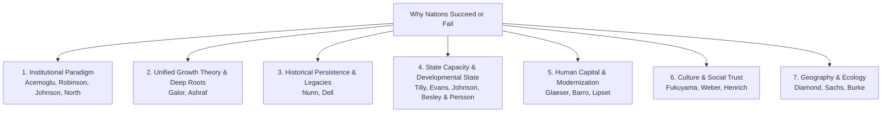
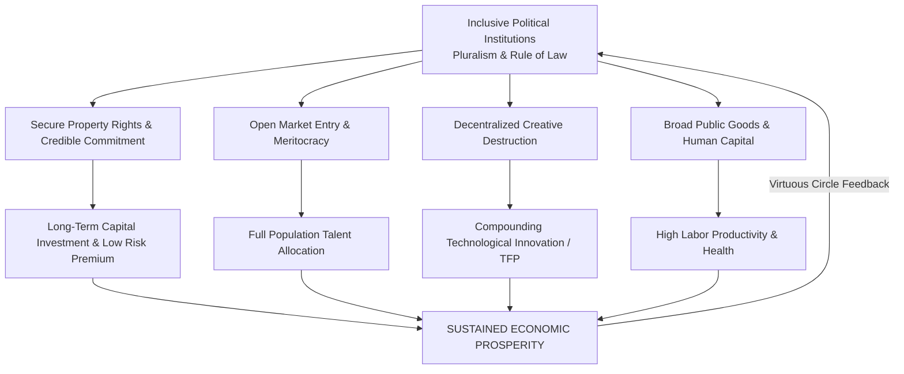
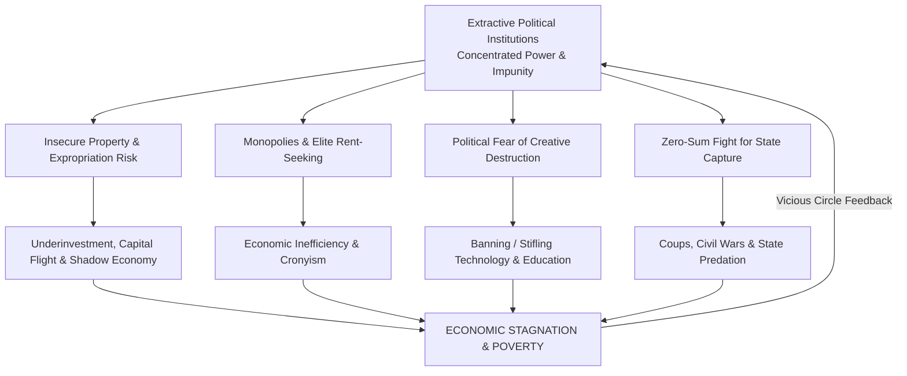

# Why Nations Succeed or Fail: A Comprehensive Literature Review

> *"The reason that Britain is richer than Egypt is because in 1688, Britain had a revolution that transformed the politics and thus the economics of the nation. The people fought for and won more political rights, and they used them to expand their economic opportunities."*  
> — Daron Acemoglu & James A. Robinson, *Why Nations Fail*

---

## 1. The Fundamental Question of Comparative Development

Why are citizens in some nations healthy, wealthy, and secure, while citizens in others struggle with poverty, disease, and instability?

* In 2024–2026, the GDP per capita (PPP) of Switzerland exceeded **\$85,000**, while in Burundi it was under **\$1,000**—an **85-fold difference**.
* Communities divided by a political border—such as Nogales, Arizona (USA) vs. Nogales, Sonora (Mexico), or North Korea vs. South Korea—experience drastically different life outcomes despite sharing identical geography, ancient lineage, and ecological conditions.

Modern academic literature organizes the answers to this question into **seven major theoretical paradigms**, spanning classical political economy to 21st-century econometric research.

---

## 2. Taxonomy of Major Theoretical Frameworks



---

## 3. The Institutional Paradigm: Cause, Effect, and Mechanics

The institutional paradigm was awarded the **2024 Nobel Memorial Prize in Economic Sciences** (Daron Acemoglu, Simon Johnson, and James A. Robinson) *"for studies of how institutions are formed and affect prosperity."*

### The Axiom of Institutional Economics
Institutions are the formal laws, regulations, and informal social norms that structure human interaction (**"the rules of the game"** — Douglass North). 

The core causal chain connects institutional rules to macroeconomic outcomes through human incentives:

```
┌─────────────────┐       ┌─────────────────┐       ┌─────────────────┐       ┌─────────────────┐
│  INSTITUTIONAL  │ ────► │   INDIVIDUAL    │ ────► │  MICROECONOMIC  │ ────► │  MACROECONOMIC  │
│   STRUCTURES    │       │   INCENTIVES    │       │    BEHAVIORS    │       │    OUTCOMES     │
│ (Laws, Courts,  │       │ (Risk, Reward,  │       │ (Invest, Save,  │       │ (Growth, TFP,   │
│  Property, Power)│      │  Protection)    │       │  Innovate, Rent)│       │  Peace / Ruin)  │
└─────────────────┘       └─────────────────┘       └─────────────────┘       └─────────────────┘
```

---

### A. The Causal Anatomy of Success: Why Inclusive Institutions Drive Prosperity

Inclusive institutions combine **Inclusive Economic Institutions** (secure property rights, unbiased contract enforcement, free entry into markets, public goods) with **Inclusive Political Institutions** (pluralism distributing power broadly + sufficient state centralization to enforce order).



#### 1. Secure Property Rights & The "Credible Commitment" Mechanism
* **The Cause:** When political institutions impose binding constitutional checks on the sovereign/executive (as in Britain after the 1688 Glorious Revolution), the state can make a **credible commitment** that it will not arbitrarily seize wealth, raise confiscatory taxes, or alter contracts (*North & Weingast, 1989*).
* **The Microeconomic Effect:** The expropriation risk premium collapses. Entrepreneurs, farmers, and financiers calculate that they will actually retain the future fruits of their labor. Long-term capital horizons expand from months to decades.
* **The Macroeconomic Result:** Massive capital accumulation. Interest rates drop dramatically (in post-1688 England, government borrowing rates plummeted from 10%+ to 3–4%), making large-scale infrastructure, mills, railways, and factories economically viable.

#### 2. Broad Talent Allocation & Meritocratic Entry
* **The Cause:** Inclusive institutions guarantee open access to occupations and credit, dismantling aristocratic monopolies, guild restrictions, and caste barriers (*Hernando de Soto, 2000; William Baumol, 1990*).
* **The Microeconomic Effect:** Millions of non-elites can obtain legal titles, collateralize property to secure loans, register businesses, and patent inventions without paying bribes.
* **The Macroeconomic Result:** The economy mobilizes the cognitive and entrepreneurial genius of the **entire population** (100%) rather than a narrow hereditary aristocracy (1–2%). Inventions surge (e.g., the Industrial Revolution was driven by self-taught mechanics, watchmakers, and weavers like Thomas Newcomen, James Watt, and Richard Arkwright).

#### 3. Sustained Creative Destruction (Joseph Schumpeter)
* **The Cause:** In a pluralistic political system, incumbent elites who own legacy industries do not hold a monopoly on political violence and cannot easily pass laws banning new technologies.
* **The Microeconomic Effect:** New innovators are legally permitted to introduce superior products and business models that disrupt, outcompete, and bankrupt obsolete incumbents.
* **The Macroeconomic Result:** Compounding **Total Factor Productivity (TFP)** growth. The economy continuously reallocates capital and labor to the most technologically productive sectors.

#### 4. Broad Public Goods & Infrastructure Provision
* **The Cause:** Pluralistic governments depend on broad electoral coalitions or broad-based tax revenues rather than narrow mineral rents or aristocratic tributes (*Besley & Persson, 2011*).
* **The Microeconomic Effect:** The state invests heavily in universal literacy, technical universities, public sanitation, transportation grids, and commercial courts.
* **The Macroeconomic Result:** High baseline human capital and low internal transportation/transaction costs, enabling complex nationwide supply chains.

#### 5. The Virtuous Circle (Positive Feedback Loop)
Inclusive economic institutions create an economically independent, wealthy middle class. This middle class forms civil society organizations, labor unions, and a free press, which in turn mobilize to defend and expand inclusive political institutions against any future autocratic power grabs.

---

### B. The Causal Anatomy of Failure: Why Extractive Institutions Cause Poverty

Extractive institutions combine **Extractive Political Institutions** (power concentrated in the hands of a narrow ruler, family, or military junta without checks) with **Extractive Economic Institutions** (designed to extract wealth and rents from the many to enrich the ruling few).



#### 1. Insecurity of Property & Predatory Expropriation
* **The Cause:** The ruler or ruling clique is above the law. Property rights exist only at the whim of the autocrat. Land, businesses, or savings can be nationalized, taxed punitively, or seized by corrupt officials at any moment.
* **The Microeconomic Effect:** Rational citizens refuse to invest in fixed physical capital that cannot be hidden. Farmers plant only what they can eat; entrepreneurs keep businesses small and informal; savings are converted into gold, physical cash, or sent to offshore tax havens (**capital flight**).
* **The Macroeconomic Result:** Chronic under-capitalization, technological backwardness, and an economy dominated by low-productivity subsistence farming or informal street trading.

#### 2. Monopolies and Rent-Seeking over Wealth Creation
* **The Cause:** Lucrative economic concessions (telecom licenses, import permits, mining rights, banking monopolies) are granted exclusively to presidential cronies, family members, or oligarchs (*Mancur Olson, 1982; Gordon Tullock, 1967*).
* **The Microeconomic Effect:** The most talented and ambitious people in society do not become engineers, scientists, or productive entrepreneurs; they become **rent-seekers**—lobbying, flattering, bribing, and marrying into the ruling political elite to secure monopoly licenses.
* **The Macroeconomic Result:** High prices, poor-quality goods, lack of domestic competition, and a parasitic economy where wealth is redistributed to elites rather than newly created.

#### 3. The Political Fear of Creative Destruction
* **The Cause:** Autocrats and ruling elites prioritize their own political survival above national wealth. They understand that economic modernization creates new factories, independent business leaders, and an educated urban working class who will inevitably demand political representation and threaten the regime's survival.
* **The Microeconomic Effect:** The state deliberately blocks new technologies, censors the press, restricts university education, and passes prohibitive regulations on new industries.
* **Historical Examples:**
  * **The Ottoman Empire:** The Sultan banned the Arabic printing press in 1485 (fearing the loss of religious and political control by scribes and clerics). The ban persisted for almost 300 years, devastating literacy and scientific output across the Middle East.
  * **Tsarist Russia & Habsburg Austria-Hungary:** In the 1830s–1850s, Tsar Nicholas I and Emperor Francis I explicitly restricted the construction of railways and steam factories, openly stating that industrialization would create an urban proletariat that would revolt against the monarchy.

#### 4. The Zero-Sum Trap & Violent State Capture
* **The Cause:** Because the state is an extractive machine, controlling the presidency, ministry, or military is the **only path to immense wealth**. Losing power means not just losing an election, but facing exile, imprisonment, or financial ruin.
* **The Microeconomic Effect:** Political competitors have no incentive to compromise or play by constitutional rules. Politics becomes an existential, zero-sum war.
* **The Macroeconomic Result:** High frequency of military coups, political purges, armed rebellions, ethnic factionalism, and civil war (e.g., the post-colonial history of DR Congo, Sierra Leone, Nigeria, Syria).

#### 5. The Vicious Circle & The "Iron Law of Oligarchy" (Robert Michels)
Extractive political institutions generate astronomical wealth for the ruling elite, which they use to fund secret police, private presidential guards, and patronage networks to rig elections and silence opposition. Even when an extractive dictator is overthrown in a revolution, the new leaders inherit the preexisting extractive state machinery and rarely dismantle it; they simply replace the old dictator at the top of the pyramid (e.g., the Bolsheviks replacing the Tsars; post-colonial military juntas replacing colonial governors).

---

### C. Why Extractive Growth is Real But Unsustainable: The Innovation Wall

A common point of confusion is: *If extractive institutions cause failure, why did the Soviet Union industrialize rapidly in the 1930s–1950s, why did ancient Rome flourish, and why has modern China grown so fast?*

Acemoglu and Robinson demonstrate that **growth under extractive institutions is entirely possible, but faces an insurmountable structural limit**:

```
                       GROWTH REGIMES: INCLUSIVE VS. EXTRACTIVE
GDP Per Capita
      ▲
      │                                       /  INCLUSIVE GROWTH
      │                                      /   (Endless frontier via
      │                                     /     continuous creative destruction)
      │                                    /
      │            THE INNOVATION WALL   /
      │                    ┌───────────┐/
      │                   /│           │
      │                  / │           │
      │                 /  │           │────── EXTRACTIVE GROWTH STAGNATES
      │   EXTRACTIVE   /   │           │       (Resource reallocation exhausted;
      │   CATCH-UP    /    │           │        stifles innovation & ignites infighting)
      │              /     │           │
      └─────────────/──────┴───────────┴──────────────────────────────► Time
```

#### Phase 1: Rapid Extractive Catch-Up (Resource Reallocation)
An authoritarian regime can generate rapid economic growth by using state coercion to shift labor and capital from low-productivity traditional farming into known, established industrial technologies (e.g., Stalin forcing millions of peasants into steel mills and coal mines; Soviet GDP grew rapidly from 1928 to 1960).

#### Phase 2: The Innovation Wall
Once all agricultural labor has been moved to factories and the economy reaches the global technological frontier, **further growth requires technological innovation, efficiency gains, and creative destruction**.
* Innovation cannot be commanded at gunpoint. It requires individual experimentation, reward incentives, freedom to challenge orthodoxies, and decentralized capital allocation.
* In extractive systems, creative destruction is blocked, incentives to innovate are absent, and central planning degenerates into bureaucratic stagnation.
* *Result:* The Soviet economy completely stagnated from the 1970s onward and collapsed in 1991. Ancient Rome collapsed into civil wars over slave and land rents.

---

### D. Four Historic Natural Experiments of the Causal Chain

```
┌──────────────────────────────────────────────────────────────────────────────────────────────────┐
│                             HISTORICAL NATURAL EXPERIMENTS                                       │
├────────────────────────────────┬────────────────────────────────┬────────────────────────────────┤
│ Case Study                     │ Institutional Setup (Cause)    │ Economic Outcome (Effect)      │
├────────────────────────────────┼────────────────────────────────┼────────────────────────────────┤
│ 1. England: The Glorious       │ 1688 Parliament stripped the   │ Interest rates fell to 3%;     │
│    Revolution (1688)           │ Crown of arbitrary taxation    │ patent system protected; led   │
│                                │ and court interference.        │ to the Industrial Revolution.  │
├────────────────────────────────┼────────────────────────────────┼────────────────────────────────┤
│ 2. Medieval Venice: From       │ 10th–13th c. *Colleganza*      │ 1297 *La Serrata* closed the   │
│    Inclusion to *La Serrata*   │ contract enabled open trade    │ Council to new families; trade │
│                                │ and social mobility.           │ died; Venice became a museum.  │
├────────────────────────────────┼────────────────────────────────┼────────────────────────────────┤
│ 3. North Korea vs.             │ Same language, geography, and  │ South Korea is 20x richer;     │
│    South Korea (1945–Present)  │ history; split into totalitarian│ North Korea suffers chronic    │
│                                │ extraction vs. inclusive market│ famines and energy poverty.    │
├────────────────────────────────┼────────────────────────────────┼────────────────────────────────┤
│ 4. Colonial Divergence:        │ High settler mortality $\to$   │ Extractive institutions        │
│    North vs. South America     │ extractive looting (Potosí);   │ persisted post-independence,   │
│    (Acemoglu et al., 2001)     │ low mortality $\to$ inclusive  │ causing 200+ years of wealth   │
│                                │ property (Virginia Assembly).  │ and governance divergence.     │
└────────────────────────────────┴────────────────────────────────┴────────────────────────────────┘
```

---

## 4. Unified Growth Theory: Breaking the Malthusian Trap

* **Key Thinker:** Oded Galor (*Unified Growth Theory*, 2011; *The Journey of Humanity: The Origins of Wealth and Inequality*, 2022).

For nearly 300,000 years of human history, humanity was trapped in the **Malthusian Epoch**: technological progress increased the size of the population, but left per capita living standards roughly near subsistence.

```
                    THE GREAT TRANSITION (1800–PRESENT)
Population Size + Tech Momentum ──► High Return to Education (Human Capital)
                                ──► Demographic Transition (Fewer, better-educated children)
                                ──► Sustained Per Capita GDP Growth (Escape from Malthus)
```

### Core Contributions:
1. **The Phase Transition:** As technology advanced during the Industrial Revolution, the return on human skills (literacy, engineering, science) spiked. Parents shifted from maximizing the *quantity* of children to the *quality* (education) of children.
2. **The Great Divergence:** Regions that fostered environments conducive to education, gender equality, and institutional flexibility underwent the demographic transition earlier, creating the modern global wealth gap.

> [!NOTE]
> **Scholarly Controversy: Ashraf & Galor (2013) — Genetic Diversity and Development:** The linked paper by Quamrul Ashraf and Oded Galor, proposing a "hump-shaped" relationship between genetic diversity (derived from prehistoric out-of-Africa migrations) and long-run economic prosperity, has been **contested in replication studies**. Critics (including Guedes et al., *Current Anthropology*, 2013, and Caraher, 2018) argue the results are sensitive to data selection and question whether neutral genetic markers are valid proxies for economically relevant traits. The paper is cited for its framework, but readers should be aware it remains actively disputed. Galor's broader *Unified Growth Theory* itself (the Malthusian trap mechanism and demographic transition) is more widely accepted.

---

## 5. Historical Persistence & Deep Colonial Legacies

* **Key Economists:** Nathan Nunn (Harvard), Melissa Dell (2020 Clark Medalist), Stelios Michalopoulos, Elias Papaioannou.

Modern econometric research uses historical micro-data and natural experiments to show how distant shocks create persistent path-dependent development outcomes:

```
┌─────────────────────────────────────────────────────────────────────────────┐
│                    LANDMARK HISTORICAL PERSISTENCE FINDINGS                 │
├───────────────────────────┬─────────────────────────────────────────────────┤
│ The African Slave Trades  │ Regions most heavily raided for slaves between  │
│ (Nathan Nunn, QJE 2008)   │ 1400–1900 exhibit significantly lower GDP       │
│                           │ per capita and lower interpersonal trust today. │
├───────────────────────────┼─────────────────────────────────────────────────┤
│ Peru's Mining Mita        │ Areas historically subjected to forced mining   │
│ (Melissa Dell, 2010)      │ labor (*Mita*) in colonial Peru suffer lower    │
│                           │ household consumption and worse road networks.  │
├───────────────────────────┼─────────────────────────────────────────────────┤
│ Pre-Colonial Institutions │ African ethnicities with centralized pre-       │
│ (Michalopoulos &          │ colonial legal structures show higher modern    │
│  Papaioannou, 2013)       │ economic activity (measured by night lights).   │
└───────────────────────────┴─────────────────────────────────────────────────┘
```

---

## 6. State Capacity & The Developmental State Model

* **Key Thinkers:** Charles Tilly (*Coercion, Capital, and European States*, 1990), Chalmers Johnson (*MITI and the Japanese Miracle*, 1982), Alice Amsden (1989), Robert Wade (1990), Timothy Besley & Torsten Persson (*Pillars of Prosperity*, 2011), Yuen Yuen Ang (*How China Escaped the Poverty Trap*, 2016).


### Core Arguments:
1. **Pillars of Prosperity (Besley & Persson, 2011):** Development requires a two-way cluster of **Fiscal Capacity** (the ability to collect broad taxes) and **Legal Capacity** (the ability to enforce contracts and property rights).
2. **The East Asian Developmental State:** Nations like **Japan, South Korea, Taiwan, and Singapore** used meritocratic, Weberian bureaucracies that directed credit to strategic industries while enforcing **export discipline** (subsidies were revoked if firms failed to compete in global markets).
3. **Coevolutionary Development in China (Yuen Yuen Ang, 2016, updated 2023):** China's rise demonstrated that markets and state institutions can co-evolve through local bureaucratic **"Directed Improvisation"** — Beijing sets broad goals while local officials experiment with indigenous resources. In 2023, Ang formalized this into **AIM (Adaptive, Inclusive, Moral) Political Economy**, applying these co-evolutionary lessons beyond China to broader global development challenges.

---

## 7. Human Capital & Modernization Theory

* **Key Thinkers:** Seymour Martin Lipset (1959), Edward Glaeser, Rafael La Porta, Florencio Lopez-de-Silanes, & Andrei Shleifer (*Do Institutions Cause Growth?*, 2004), Robert Barro (1991).

```
Investments in Basic Literacy & Public Health ──► Skilled Workforce ──► Institutional Maturation & Democracy
```

* **The Glaeser Critique:** Glaeser et al. argued that human capital is the primary engine of development. Poor countries cannot maintain democratic institutions on paper without a literate, educated citizenry capable of holding leaders accountable and running courts.

---

## 8. Culture, Social Capital, and Norms

* **Key Thinkers:** Max Weber (1905), Francis Fukuyama (*Trust*, 1995; *The Origins of Political Order*, 2011), Robert Putnam (*Making Democracy Work*, 1993), Joseph Henrich (*The WEIRDest People in the World*, 2020).

* **Generalized Trust vs. Familism:** In high-trust societies, individuals trust strangers and formal legal mechanisms, enabling large impersonal corporations and capital markets. In low-trust societies (excessive familism/clientelism), economic transactions remain restricted to kin networks, fostering corruption.

---

## 9. Geography, Ecology, and Natural Resources

* **Key Thinkers:** Jared Diamond (*Guns, Germs, and Steel*, 1997), Jeffrey Sachs (*Geography and Economic Development*, 2001), Terry Lynn Karl (*The Paradox of Plenty*, 1997), Marshall Burke et al. (*Nature*, 2015).

```
Vast Natural Resource Rents (Oil/Minerals)
              │
              ├───────────────────────────────────────────────────────┐
              ▼                                                       ▼
  "Rentier State" Dynamics                                   "Dutch Disease"
  • Elites don't need taxes from productive citizens         • Currency appreciates strongly
  • No incentive to build courts, schools, or rights         • Domestic manufacturing & farming
  • Zero-sum violent political conflict for resource rents     become uncompetitive and hollow out
```

* **The Resource Curse:** In countries with weak initial institutions, resource windfalls (oil, diamonds) entrench corrupt dictatorships because rulers do not need to tax citizens and therefore do not need to grant political rights.
* **Exceptions (Norway, Botswana):** Succeeded because inclusive political and legal institutions were established *prior* to resource extraction.
* **Climate Economics (Burke, Hsiang & Miguel, 2015, ongoing):** Global economic productivity peaks at ~13°C mean annual temperature and declines non-linearly at higher temperatures. Unmitigated climate change is projected to reduce global per capita income significantly by 2100, with the heaviest burden falling on already-hot tropical nations. This research remains active and broadly accepted as a foundational baseline, though ongoing debate continues over how much economic adaptation can moderate these projections.

---

## 9B. The Missing Voices: Capabilities Approach & Structural Critiques

Three major frameworks that offer important critiques and complements to the dominant institutional paradigm are often under-represented in mainstream reviews:

### A. The Capabilities Approach (Amartya Sen & Martha Nussbaum)
* **Key Works:** Amartya Sen (*Development as Freedom*, 1999); Martha Nussbaum (*Creating Capabilities*, 2011).
* **Core Idea:** GDP growth is not the goal of development. Development is the **expansion of real human freedoms** (substantive capabilities): the ability to live a full lifespan, be healthy, educated, politically empowered, and to participate in social life with dignity.
* Sen's approach reframes the question: not "why do nations fail to grow GDP?" but **"why do nations fail to expand human freedom?"** This has shaped the UN's **Human Development Index (HDI)**, which includes education, health, and income jointly.

### B. Dependency Theory & World-Systems (Structural Critique)
* **Key Thinkers:** Raúl Prebisch (1950), André Gunder Frank (*Capitalism and Underdevelopment in Latin America*, 1967), Immanuel Wallerstein (*The Modern World-System*, 1974).
* **Core Idea:** Underdevelopment is not a failure to modernize — it is the **product** of the historical world capitalist system. The global economy is divided into a Core (rich industrial nations) and a Periphery (raw material exporters). Trade structures systematically transfer wealth from the periphery to the core, making the rich richer and the poor poorer. This actively *generates* underdevelopment.

### C. Gender, Care Economy & Feminist Development Economics (2020s Frontier)
* **Key Thinkers:** Esther Duflo (*Poor Economics*, 2011), Diane Elson, Naila Kabeer, Jayati Ghosh.
* **Core Idea:** Standard development models systematically undercount **unpaid care work** (disproportionately performed by women), which is foundational to human capital formation and economic reproduction. Gender-blind institutional analysis misses how patriarchal structures, colonial gender norms, and unequal property rights keep women — and thereby whole societies — trapped in poverty. Recent 2023–2024 research increasingly calls for intersectional frameworks that connect gender inequality with colonial legacies and racial power structures.

---

## 10. Comprehensive Synthesis Matrix

| Dimension | Primary Mechanism | Landmark Contributions | Recent Contributions (2019–2026) |
| :--- | :--- | :--- | :--- |
| **Institutions** | Inclusive vs. extractive rules of the game; creative destruction. | Acemoglu, Johnson, Robinson (2001, 2012); North (1990). | *The Narrow Corridor* (2019); *Power and Progress* (2023); **2024 Nobel Prize**. |
| **Unified Growth** | Escape from Malthusian trap via human capital & demographic shift. | Galor (2011); Ashraf & Galor (2013) ⚠️ *contested*. | *The Journey of Humanity* (Galor, 2022). |
| **Historical Persistence** | Deep historical shocks (slavery, colonial labor) shape modern norms & state. | Nunn (2008); Dell (2010); Michalopoulos & Papaioannou (2013). | Nunn (*Historical Roots of Development*, 2020). |
| **State Capacity** | Fiscal/legal capacity, meritocratic bureaucracy, export discipline. | Tilly (1990); Chalmers Johnson (1982); Amsden (1989). | Besley & Persson (2011); Ang — AIM Political Economy (2023). |
| **Human Capital** | Mass literacy and health drive economic and democratic maturation. | Lipset (1959); Glaeser et al. (2004); Barro (1991). | Hanushek & Woessmann (*Knowledge Capital of Nations*, 2015). |
| **Culture & Trust** | Impersonal trust, social capital, and civic norms reduce transaction costs. | Weber (1905); Putnam (1993); Fukuyama (1995). | Henrich (*The WEIRDest People in the World*, 2020). |
| **Geography & Climate** | Agricultural diffusion, disease burden, transport access, climate impact. | Diamond (1997); Sachs & Warner (1995, 2001). | Burke, Hsiang, & Miguel (*Nature*, 2015; updated NBER 2024). |
| **Capabilities** | Development = expansion of human freedoms, not just GDP growth. | Sen (*Development as Freedom*, 1999); Nussbaum (2011). | UN Human Development Reports (annual). |
| **Structural / World-Systems** | Wealth transfer from periphery to core via global trade structures. | Prebisch (1950); Frank (1967); Wallerstein (1974). | Kvangraven et al. — Decolonizing Economics (2024). |
| **Gender & Care Economy** | Unpaid care work and gendered property rights structurally constrain development. | Elson, Kabeer (1990s–2000s); Duflo (2011). | Ghosh, feminist economics curricula reform (2023–2025). |

---

## 11. Landmark Academic Bibliography

1. **Foundational & Recent Institutional Literature:**
   * Acemoglu, D., Johnson, S., & Robinson, J. A. (2001). *"The Colonial Origins of Comparative Development: An Empirical Investigation"*. *American Economic Review*, 91(5), 1369–1401.
   * Acemoglu, D., & Robinson, J. A. (2012). *Why Nations Fail: The Origins of Power, Prosperity, and Poverty*. Crown Business.
   * Acemoglu, D., & Robinson, J. A. (2019). *The Narrow Corridor: States, Societies, and the Fate of Liberty*. Penguin Press.
   * Acemoglu, D., & Johnson, S. (2023). *Power and Progress: Our Thousand-Year Struggle Over Technology and Prosperity*. PublicAffairs.
   * North, D. C. (1990). *Institutions, Institutional Change and Economic Performance*. Cambridge University Press.
   * North, D. C., & Weingast, B. R. (1989). *"Constitutions and Commitment: The Evolution of Institutions Governing Public Choice in Seventeenth-Century England"*. *Journal of Economic History*, 49(4), 803–832.
2. **Unified Growth Theory & Deep Roots:**
   * Galor, O. (2011). *Unified Growth Theory*. Princeton University Press.
   * Galor, O. (2022). *The Journey of Humanity: The Origins of Wealth and Inequality*. Dutton.
   * Ashraf, Q., & Galor, O. (2013). *"The 'Out of Africa' Hypothesis, Human Genetic Diversity, and Comparative Economic Development"*. *American Economic Review*, 103(1), 1–46.
3. **Historical Persistence & Econometric Natural Experiments:**
   * Nunn, N. (2008). *"The Long-Term Effects of Africa's Slave Trades"*. *Quarterly Journal of Economics*, 123(1), 139–176.
   * Nunn, N. (2020). *"The Historical Roots of Economic Development"*. *Science*, 367(6485).
   * Dell, M. (2010). *"The Persistent Effects of Peru's Mining Mita"*. *Econometrica*, 78(6), 1863–1903.
   * Michalopoulos, S., & Papaioannou, E. (2013). *"Pre-colonial Ethnic Institutions and Contemporary African Development"*. *Econometrica*, 81(1), 113–152.
4. **State Capacity & Developmental Economics:**
   * Besley, T., & Persson, T. (2011). *Pillars of Prosperity: The Political Economics of Development Clusters*. Princeton University Press.
   * Ang, Y. Y. (2016). *How China Escaped the Poverty Trap*. Cornell University Press.
   * Johnson, C. (1982). *MITI and the Japanese Miracle*. Stanford University Press.
5. **Culture, Human Capital & Geography:**
   * Glaeser, E. L., et al. (2004). *"Do Institutions Cause Growth?"*. *Journal of Economic Growth*, 9(3), 271–303.
   * Henrich, J. (2020). *The WEIRDest People in the World*. Farrar, Straus and Giroux.
   * Diamond, J. (1997). *Guns, Germs, and Steel*. W. W. Norton & Co.
   * Burke, M., Hsiang, S. M., & Miguel, E. (2015). *"Global non-linear effect of temperature on economic production"*. *Nature*, 527(7577), 235–239.
6. **Capabilities Approach:**
   * Sen, A. (1999). *Development as Freedom*. Knopf.
   * Nussbaum, M. (2011). *Creating Capabilities: The Human Development Approach*. Harvard University Press.
7. **Structural & World-Systems Theory:**
   * Prebisch, R. (1950). *The Economic Development of Latin America and Its Principal Problems*. UN/ECLA.
   * Wallerstein, I. (1974). *The Modern World-System*. Academic Press.
   * Frank, A. G. (1967). *Capitalism and Underdevelopment in Latin America*. Monthly Review Press.
8. **Gender & Feminist Development Economics:**
   * Duflo, E., & Banerjee, A. (2011). *Poor Economics: A Radical Rethinking of the Way to Fight Global Poverty*. PublicAffairs.
   * Kabeer, N. (1994). *Reversed Realities: Gender Hierarchies in Development Thought*. Verso.
